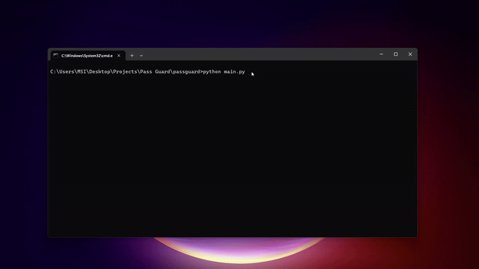

# 🔐 PassGuard

**PassGuard** is a secure, offline-first password manager built with **Python and CustomTkinter.**  
It supports multi-vault encryption using **AES-GCM and Argon2id** and is designed with **cybersecurity** principles and UX in mind.

---

## ✨ Features

- 🔑 Secure AES-GCM + Argon2id vault encryption
- 🧠 Multiple profile vaults (label-based selection)
- 👁️ Hold-to-reveal password (left or right click)
- 📋 Copy password to clipboard
- 🔐 Master password enforcement (length + complexity)
- 🔄 Vault "Lock" feature (app relaunch with logout)
- ⚙️ Secure password generator (symbols, digits, case)
- ⌨️ Full keyboard navigation support (Ctrl+N, arrows, Enter)
- 🎨 Dark/light compatible theme with CustomTkinter (Only Dark implemented for now)
- 💾 Auto-encryption after each vault update
- 💡 Smart validation and error prompts
- ✅ Ready-to-use `.exe` in Release V1.0

---

## 🚀 How to Run (Python Source)

```bash
# Clone the repo
git clone https://github.com/yourusername/passguard.git
cd passguard

# Install dependencies
pip install -r requirements.txt

# Run the application
python main.py
```

---

## 🎥 Demo



---

## 🔐 Encryption Details

| Feature              | Value                         |
|----------------------|-------------------------------|
| Key Derivation       | Argon2id                      |
| Encryption Algorithm | AES in GCM Mode               |
| Salt Length          | 16 bytes                      |
| Nonce Length         | 12 bytes                      |
| Auth Tag             | 16 bytes                      |
| Clipboard Handling   | Auto-clears after 15 seconds  |

All vault files are strongly encrypted. No credentials or labels are stored in plain text.

---

## 📁 Project Structure

```bash
passguard/
├── core/
│   ├── crypto.py         # Encryption/decryption logic
│   └── vault.py          # Vault creation, loading, and saving
│
├── ui/
│   ├── main_window.py    # Main dashboard for vault interaction
│   └── unlock_dialog.py  # Vault unlock / creation dialog
│
├── vaults/
│   ├── *.dat             # Encrypted vault files
│   └── labels.json       # Mapping of vault filenames to labels
│
├── assets/
│   └── icon.ico          # App icon for GUI and executable
│
├── main.py               # Application entry point
├── requirements.txt      # All required Python packages
├── LICENSE               # MIT License
└── README.md             # This file
```

---

## 🔧 Usage Guide

- **Select or create vault** on launch
- **Enter master password** to unlock a vault
- **Create credentials** using the Add button or `Ctrl+N`
- **Reveal password** by holding the 👁️ icon (left/right click)
- **Edit/Delete credentials** via respective buttons
- **Generate secure password** (includes special characters)
- **Lock vault** to return to login and reset memory

---

## 📜 requirements.txt

```bash
customtkinter
argon2-cffi
pyperclip
pycryptodome
```

---

## 🧠 Ideas for the Future

- OTP/TOTP support
- Import/export vaults
- Biometric unlock (platform-specific)
- Auto-backup encrypted vaults

---

## 🛡 License

```text
MIT License

Copyright (c) 2025 Arjun

Permission is hereby granted, free of charge, to any person obtaining a copy
of this software and associated documentation files (the "Software"), to deal
in the Software without restriction...
```

(Full license is in `LICENSE` file)

---

## 👨‍💻 Author

**Arjun**  
🔗 [LinkedIn](https://www.linkedin.com/in/arjunjaincs)  
🎓 Cybersecurity student & developer passionate about privacy

---